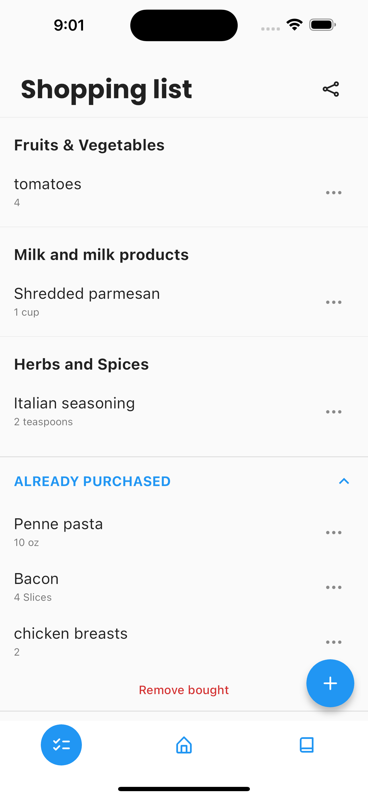

# Foodly/Foodster - Meal Planning

**Meal planning with calendar, shopping list and cookbook.**

With Foodly/Foodster, you can easily plan your food for the upcoming week with your family, friends and roommates. It's a perfect synergy of planning, cookbook and shopping list.

## Download 

- Android: [Get it on **Google Play**](https://play.google.com/store/apps/details?id=io.golenia.foodly)
- iOS: [Download on the **AppStore**](https://apps.apple.com/de/app/foodster-planen-einkaufen/id1590739803)

## Screenshots

Join plan|Weekly plan|Shopping list
:-:|:-:|:-:
||

Cook book|Meal details|Settings
:-:|:-:|:-:
||
